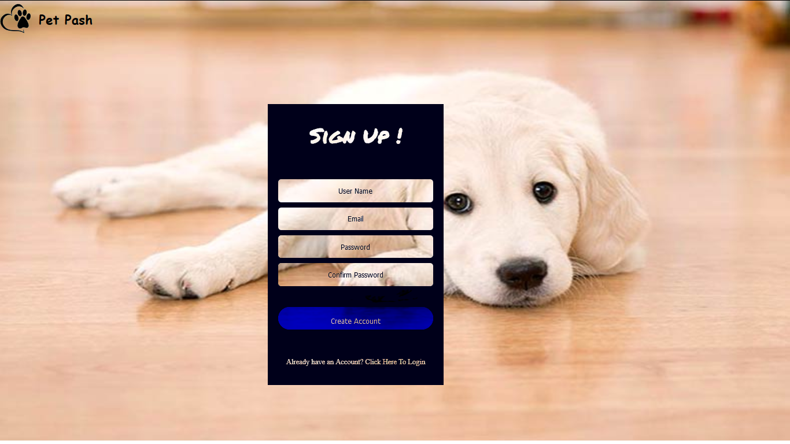

# Online Pet Shop Management System

##	Problem Statement

Design an Online Pet Shop Management System which will have 3 modules described as follows:
a)	Vet Appointment:  which will schedule vet-appointments for pets and store the entries in the table called 'appointment'.
b)	Adoption: in which users will be able to see pets available for adoption (information retrieved from database called 'avpets') and which will allow users to fill the cat/dog form and these requests will be stored in a different table called 'adopt' .
c)	Paw Cart: which will display menu of food items, toys and pet treats available for shopping. This information will be retrieved from a table called 'foodtoys'. When user places an order, then that entry must be made in database called 'orders' and listing of individual items in the order will be mapped according to order number in table called 'orderitems'.
The user must first create an account and login before accessing these modules. The information related to user accounts will be stored in table called 'user'.

##	Framework of the proposed work in project

* Creating Required Database and Tables 
Firstly, database with all the tables including proper schema and primary, foreign keys is created.

*	Creating Login/Signup Page
Next, Login/Signup Page layout is created and proper validation for each element in login/signup form is made using PHP.

*	Creating Home Page of Website
A detailed design of the homepage is created with application of CSS and HTML and various modules were linked to it.

*	Creating Vet-Appointment Module
A proper PHP validated form for every input field was made and thank you page when appointment is scheduled is created.

*	Creating Adoption Module
In this module, there are links for filling Cat Adoption and Dog Adoption Forms made with PHP validation. And another link is there which shows pets available for adoption in which values are retrieved from database and displayed in table format.

*	Creating PawCart Module
It displays a menu showing different items for shopping, values of which are retrieved from database. It shows items which are out of stock in grey field. There are 2 forms, one for placing an order where user has to enter item codes and quantity, and another for confirming order where order summary is shown and user has to enter address and mobile number and confirm the order. Then a thank you page will be shown.

For more information, click <a href="Project Report.pdf">HERE</a>.

</img>
